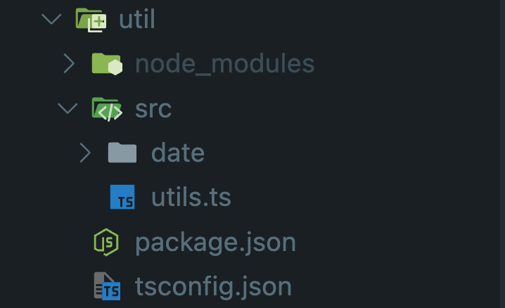
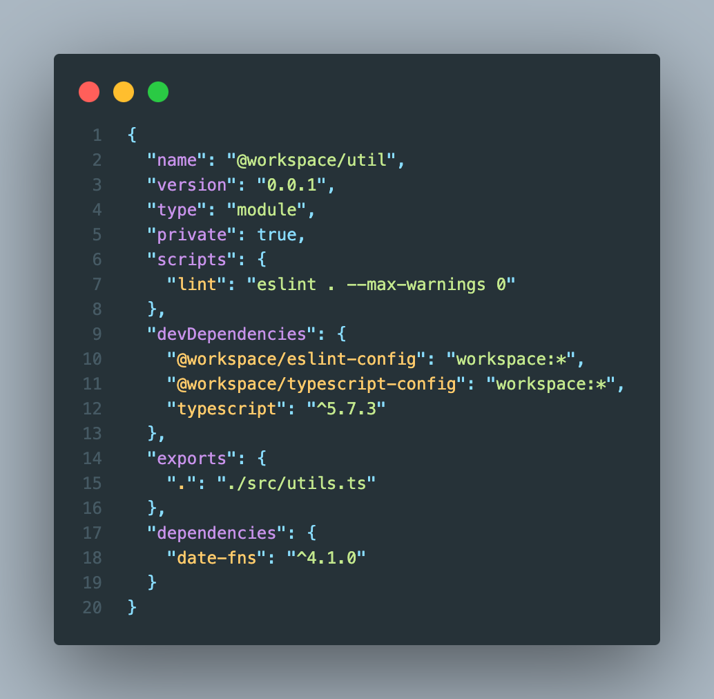

# 모노레포 설명

---

## ODS 문제점

- ODS의 `web`, `web-admin` (공용 로직, 유틸, 컴포넌트..) 등 같은 코드인데 두번 고쳐야했음
- 공용 로직에 필요한 노드 모듈이 해당 프로젝트에 종속되어있었음
- 즉, 중복 코드 관리가 불편하고 의존성 관리가 비효율적이었음

---

## 모노레포란?

- "여러 프로젝트"를 "하나의 저장소"에서 관리하는 방식
- 공통 코드를 패키지로 분리하여 재사용 가능
- 의존성 관리가 용이하고 버전 관리가 일관적

---

## 얻고자 하는 것

- 필요한 커스텀 로직 패키지를 꺼내서 사용할 수 있음
- 완전 독립적으로 작동함
- 버전 관리가 일관적
- 빌드 프로세스 최적화
- 팀 협업 효율성 향상

---

## 모노레포 도입 시 고려사항

- 초기 설정의 복잡성
- CI/CD 파이프라인 수정 필요

---

## 모노레포 구조 예시

```
monorepo/
├── packages/
│   ├── common/        # 공통 유틸리티
│   ├── components/    # 공통 컴포넌트
│   └── config/        # 공통 설정
├── apps/
│   ├── web/          # 웹 애플리케이션
│   └── web-admin/    # 관리자 애플리케이션
└── package.json
```

---



## packages - util 예시

- util 내부 node_modules는 util에서만 사용됨
- `package.json`로 해당 패키지를 관리
  = (우리만의 라이브러리를 만드는 느낌)

---



### util - package.json

- `name` : 패키지 이름
- `dependencies` : 노드 모듈 의존
- `devDependencies` : 개발 의존 (TS, IDE 자동 완성 등..)
- `exports` : 내보낼 코드

---

### packages - util - utils.ts

```ts left
import { DateUtil } from './date/date';

export class Util {
  static Date = DateUtil;
}
```

---

## web에서 util 사용법

1. web 내부 `package.json` 작성
2. 개발 편의성을 위한 `tsconfig.json` 작성
3. 편하게 `import` 해서 사용!

---

### web - package.json

```json
  "dependencies": {
    // ...
    "@workspace/util": "workspace:*", // pnpm 워크스페이스 문법
    "next": "^15.3.3",
    "next-themes": "^0.4.4",
    "react": "^19.0.0",
    "react-dom": "^19.0.0"
  },
```

- `util` 에서 설치했던 패키지 디펜던시를 `web`에서도 참조
- `web` 에서만 필요한 패키지들(`next`,`react`)도 확인 가능

---

### web - tsconfig.json

```json
{
  "extends": "@workspace/typescript-config/nextjs.json",
  "compilerOptions": {
    "paths": {
      "@workspace/util": ["../../packages/util/src/utils.ts"]
    }
  }
  // ...
}
```

- `extends`에서 타입스크립트 설정도 공용화 하여 사용하는걸 확인
- `compilerOptions` 에서 import 가독성 관리

---

### web 내부에서 사용

```tsx
// tsconfig를 설정안하면 다음과 같이 보임
// import { Util } from "../../packages/util/src/utils.ts";

import { Util } from '@workspace/util';

const TestDate = () => {
  const exampleDate = '2025-05-13T13:47:59.039995115Z';
  const formattedDate = Util.Date.formatDate(exampleDate);

  return <div>{formattedDate}</div>;
};

export { TestDate };
```
